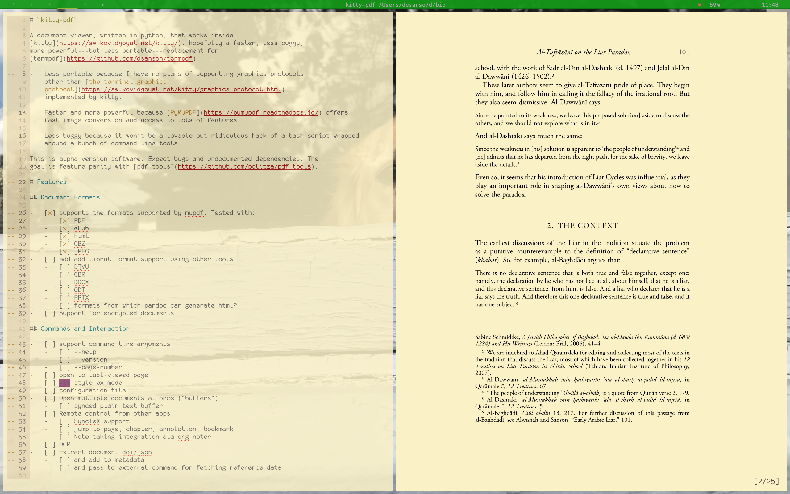

# `termpdf.py`

A graphical pdf and epub viewer, written in python, that works inside
[kitty](https://sw.kovidgoyal.net/kitty/).

I wrote this to replace [termpdf](https://github.com/dsanson/termpdf), which
was a ridiculous hack of a bash script written around a bunch of command line
tools.

This is alpha software. Expect bugs. Expect changes. The
goal is feature parity with [pdf-tools](https://github.com/politza/pdf-tools).

# Screenshot



Note the alpha transparency. You can toggle this on or off by pressing `a`.

# Dependencies

-   Python 3
-   Kitty (unless other terminal emulators implement the same graphics protocol.)
-   [PyMuPDF](https://pypi.org/project/PyMuPDF/)
    -   PyMuPDF in turn depends on MuPDF. On OSX, `brew install mupdf-tools`.
-   [bibtool](http://gerd-neugebauer.de/software/TeX/BibTool/en/) for faster
	bibtex parsing than pybtex.
    - Install with `brew install bib-tool` on OSX.
-   pdflatex/texlive-core

# Installation

## Via pip/pipx

The recommended way of installing independent python applications is
[`pipx`](https://github.com/pypa/pipx), to install termpdf you can run:

```
pipx install https://github.com/dsanson/termpdf.py
```

Alternatively if you do not want to use `pipx`, the package can be installed
directly in your user site packages with
`python3 -m pip install https://github.com/dsanson/termpdf.py`.

Note that, as usual, this may upgrade/downgrade other packages leading to
unexpected changes in your environment.

Both approaches will place a `termpdf` executable under `~/.local/bin`.

## Directly

The project is packaged via [Poetry](https://github.com/python-poetry/poetry),
to install from the repository for development purposes:

```
git clone https://github.com/dsanson/termpdf.py
cd termpdf.py
poetry install
```

Alternatively it can be installed via pip as well, if using `pip` version
greater than [21.3](https://pip.pypa.io/en/stable/news/#v21-3) then editable
installs are supported, otherwise only standard installs are possible.

```
git clone https://github.com/dsanson/termpdf.py
cd termpdf.py
python3 -m venv .venv
source .venv/bin/activate
python3 -m pip install .
```

Now you can run the script in place:

    termpdf <file.pdf>

Or copy it somewhere in your path.

Or you can install it with pip:

    pip install .

# Simple Usage

This is evolving. Here is the simplest example:

	termpdf.py example.pdf

If you want to open to a specific page,

	termpdf.py -p 10 example.pdf

If you want to specify the "logical page number" of the first page,

	termpdf.py -f 132 example.pdf

(This is handy if you want to launch `termpdf.py` from a script, and your
script knows that the PDF is a journal article that begins on page 236.)

You can open several files at once:

	termpdf.py example.pdf example2.pdf example3.pdf

To cycle through several open files, press `b` (for "buffer").

# Keyboard Shortcuts

Within termpdf, key mappings are meant to be vim-style. For simple
navigation:

    j, down, space: forward [count] pages
    k, up:          back [count] pages
    l, right:       forward [count] sections
    h, left:        back [count] sections
    gg:             go to beginning of document
    G:              go to end of document
    [count]G:       go to page [count]
    q:              quit

Note that these take counts, so `10j` moves forward 10 pages.

As mentioned above, if you opened several documents at once, you can cycle through these documents by pressing `b`:

	b				cycle through documents in buffer

## Page Numbers and Page Labels

The first page of a PDF is not always page 1. termpdf.py supports PDF "Page
Labels" for managing this. If your document already has page labels,
termpdf.py will use those labels to number pages. Note that this can cause
trouble when using a command like `10G` to go to page 10, as it is quite
possible to have two pages in a single document, both labeled "10".

You can also add Page Labels from within termpdf.py.

    [count]P:       Set page label of current page to count (as an arabic
                    numeral)
    [count]I:       Set page label of current page to count (as a lowercase
                    roman numeral)

For example, if your PDF is a journal article, and the first page should be
page 283, navigate to the first page, and type `283P`. Or, if your PDF is a
book, you might navigate to the first page, and type `1I`, to start numbering
the preface material in lowercase roman numerals, and then navigate to the
proper page 1, and type `1P`, to continue numbering the rest of the PDF in
arabic numerals.

Some caveats:

-   A Page Label affects page numbering for all *subsequent unlabeled pages*.
    It does not affect the page numbering of pages before it.
-   Nothing will stop you from labelling the first page of your PDF "10", the
    second page of your PDF "10", the third page of your PDF "10", and so on.
    The result will be nonsense, and will break your ability to navigate to
    pages by page number.
-   Currently, termpdf.py offers no methods for *deleting* page labels, so if
    you make a mess, you will have to fix it with some other piece of
    software. I'm not sure what the best software is for this purpose.

## Table of Contents, Links, and Metadata

You can view the table of contents, metadata, or any links (internal or
external) on the current page:

    t:              table of contents
    f:              show links on page
    M:              show metadata

While viewing the table of contents, use `j` and `k` to navigate, and <enter> to jump to a new section.

While viewing links, use `j` and `k` to navigate, and <enter> to open the link. For internal links, this will jump to the appropriate page. External links will be opened in your browser (see URL_BROWSER for more info).

While viewing metadata, press `b` to update the metadata from an associated
bibtex file (see below for how to set this up). There is currently no support
for manually editing the metadata within termpdf.py.

## Rotation, Cropping, Inverting

You can also adjust the display of the document in a variety of ways:

    r:              rotate [count] quarter turns clockwise
    R:              rotate [count] quarter turns counterclockwise
    c:              toggle autocropping of margins
    a:              toggle alpha transparency
    i:              invert colors
    d:              darken using TINT_COLOR
    -:              zoom out (reflowable only)
    +:              zoom in (reflowable only)
    ctrl-r:         refresh

Zooming is currently only implemented for reflowable formats, like `epub`.

Alpha transparency and autocropping will only work on some PDFs. For manual
cropping, see the section below, on the visual select mode.

The refresh command is helpful if the page fails to display, or displays
funny: try hitting `ctrl-r` to see if that fixes the problem.

## Visual Select Mode

If you want to select some text and send that to nvim, you
need to enter "visual select mode":

    s:              visual select mode
    v:              toggle between selecting and not.
    n:              insert selected text in nvim at current cursor location
    a:              append selected text in nvim at end of buffer

While in visual select mode, use `j` and `k` (with counts) to move up and
down. Use `v` to toggle between selecting and not. Use 'H' and 'h' to adjust
the left edge of selection, and 'L' and 'l' to adjust the right edge of
selection. Use `y` to copy all the text within the selection to the clipboard,
`n` to insert the text at the cursor point of an attached nvim session or `a`
to append it to the end of an attached nvim session.

Note that selection of text will only work on PDFs that have embedded textual
information, and may be unreliable with OCRed text, or weirdly constructed
PDFs.

You can also use visual select mode to manually crop a document (the manual
crop is not written to the file---it just affects how the document is
displayed). Use `s` to enter visual select mode, `v` to begin a selection, and
the motion keys to select the rectangle you wish to crop to. Then press `c`.
The crop will affect all pages of the document. If you have defined a manual
crop, you can use `c` to rotate through no cropping, autocropping, and manual
cropping.

Note that visual select mode is implemented using curses, and the smallest block you can select is a terminal cell. If you want higher 'resolution', adjust kitty's font size in the window.

## Bibtex Integration

If your document has an associated bibtex citekey (see below), yanked text will include a pandoc-style citation:

	[@author2015, p. 205]

(Other citation formats are not yet implemented.) Otherwise, it will construct
a citation from the PDF metadata:

	(Author, Title, p. 205)

If you just want to send a citation to nvim, without selecting any text, you
can use `n` or `a` in normal mode, too.

# Config file

termpdf.py looks for a config file at `$HOME/.config/termpdf.py/config`. The
config file is a json file. Here is mine:

```
{
  "TINT_COLOR": "antiquewhite2",
  "BIBTEX": "/Users/desanso/d/research/zotero.bib",
  "NOTE_PATH": "/Users/desanso/org/inbox.org",
  "KITTYCMD": "kitty --single-instance --instance-group=1"
}
```

TINT_COLOR can be set to any color in pymupdf's [color database](https://pymupdf.readthedocs.io/en/latest/colors/).

BIBTEX can be set to the path of a bibtex file with information about your documents.

NOTE_PATH can be set to the path of a default notes file. The default is `$HOME/inbox.org`.

KITTYCMD is the command used to open new windows in kitty. My preferred setting is for kitty to open a new os window. If you'd prefer to have kitty open a new kitty window, replace KITTYCMD with something like:

   "KITTYCMD": "kitty @ new-window"

You can also set "URL_BROWSER". If this is not set, termpdf.py will use `open` on OSX, and otherwise, the first browser it finds from this list:

	'gnome-open', 'gvfs-open', 'xdg-open', 'kde-open', 'firefox', 'w3m',
	'elinks', 'lynx'

# citekeys and bibtex integration

If you use bibtex, you can associate a bibtex citekey with a document by using the `--citekey` cli option:

	termpdf.py --citekey author2015 example.pdf

This information will be saved, so you don't need to specify the citekey every time you open the document. (Note that processing of cli options is dumb right now. If you try to open several documents and specify several citekeys, the last citeky specified will be applied to the first document, and the others will be ignored.)

If you have specified a bibtex file by setting BIBTEX in your config, and your bibtex includes a `File` field containing the path to your document, termpdf.py will attempt to discover the citekey automatically by matching the path, so you don't need to use the `--citekey` option. Likewise, if your bibtex includes a `File` field, you can open the document by specifying its key instead of its path:

	termpdf.py --open author2015

This works for several documents as well:

	termpdf.py --open author2015 --open author2016

Both of these features rely on pybtex, but it takes awhile for pybtex to parse
a large bibtex database. So, if `bibtool` is installed, termpdf.py will use it to speed things up.

# nvim interaction

If you attempt to send a note to nvim, using `n` or `a`, and nothing has been
set up, termpdf.py will open a new window in kitty (using KITTYCMD), open nvim
in that window, and attach itself to that window, so that future notes will be
sent there as well.

Alternatively, you can specify an nvim_listen_address on the command line:

    termpdf.py --nvim-listen-address '/var/folders/tn/fjvms9ln3nvg8tztwcl31q1c0000gp/T/nvims23DfE/0'

You can find the address for your current nvim session, either as the value of
NVIM_LISTEN_ADDRESS, or as the value of `v:servername`:

    :echo $NVIM_LISTEN_ADDRESS
    :echo v:servername

You can set the address when launching nvim:

    nvim --listen '/tmp/termpdf_nvim_bridge'

But perhaps it is simplest to define a function in your nvimrc, to open
termpdf from within nvim. Here is the somewhat clunky function I am currently
using:

```
function! OpenPDFCitekey()
   let kcmd = 'kitty --single-instance --instance-group=1 '
   let kcmd = kcmd . 'termpdf.py --nvim-listen-address '
   let kcmd = kcmd . $NVIM_LISTEN_ADDRESS . ' '
   let key=expand('<cword>')
   keepjumps normal! ww
   let page=expand('<cword>')
   if page ==? 'p'
       keepjumps normal! ww
       let page=expand('<cword>')
   endif
   keepjumps normal! bbb
   let kcmd = kcmd . '--open ' . key . ' '
   if page
       let kcmd = kcmd . '-p ' . page
   endif
   exe "!" . kcmd
endfunction
```

When called, this function treats the current word as a citekey, and attempts
to open the document associated with that citekey in termpdf.py, jumping to
the cited page if there is one. Notes will now be sent back to this document
in nvim.

# Cached document settings

termpdf.py creates a cache directory in `$HOME/.cache/termpdf.py`, and uses
the cache to save settings for each document you open. Documents will
automatically open to the last viewed page, with the same cropping and
rotation, etc.

Sometimes, that's not what you want.

    termpdf.py --ignore-cache example.pdf

will open the document up "fresh", ignoring any saved settings.

# Features

## Document Formats

-   [x] supports the formats supported by mupdf. Tested with:
    -   [x] PDF
    -   [x] ePub
    -   [x] Html
    -   [x] CBZ
    -   [x] JPEG
-   [ ] add additional format support using other tools
    -   [ ] DJVU
    -   [ ] CBR
    -   [ ] DOCX
    -   [ ] ODT
    -   [ ] PPTX
    -   [ ] formats from which pandoc can generate html?
-   [ ] Support for encrypted documents (should be trivial to add with
    pymupdf)

## Commands and Interaction

-   [ ] support command line arguments
    -   [x] --help
    -   [x] --version
    -   [x] --page-number
    -   [x] --first-page
	-   [x] --citekey
	-   [x] --open (by citekey)
-   [x] remember last-viewed page and document state
-   [ ] vim-style ex-mode
-   [ ] configuration file
    -   [ ] configurable key mappings
    -   [x] basic configuration
-   [x] Open multiple documents at once ("buffers")
-   [ ] Remote control from other apps
    -   [x] msgpack-rpc for interaction with nvim
        -   [x] send selected text to nvim buffer
        -   [x] send page number to buffer
        -   [ ] configurable format for sent text
        -   [x] jump back from nvim to page in text
            (see the clunky vimscript function above)
    -   [ ] SyncTeX support
    -   [ ] jump to page, chapter, annotation, bookmark
    -   [ ] Note-taking integration ala org-noter

## Navigation

-   [x] vim-style navigation
    -   [x] next-page, prev-page (with counts)
    -   [x] next-chapter, prev-chapter (with counts)
    -   [x] jump to page number
    -   [x] jump to beginning, end of document
-   [ ] logical page numbers
    -   [x] read PDF pagelabels
    -   [x] write PDF pagelabels
-   [x] navigate via table of contents
    -   [ ] outline folding support
-   [ ] Thumbnail mode
    -   [ ] Navigation
    -   [ ] Deleting pages
    -   [ ] Adding pages
    -   [ ] Moving pages within document
    -   [ ] Creating new document from selected pages
-   [x] Follow/fetch urls and internal links on page
-   [x] view document metadata
    -   [ ] edit metadata
    -   [x] update metadata from bibtex (requires that you set a citekey
            via the cli (`--citekey key`) and that you configure BIBTEX
            in the config file.

## Image Manipulation

-   [x] page rotation
    -   [ ] save rotation state to PDF
-   [x] toggle transparency
-   [x] invert colors ("dark mode")
-   [x] toggle tinted background
-   [ ] Cropping and zooming
    -   [x] autocrop margins
    -   [x] manual cropping using visual select mode
    -   [ ] fit to width
    -   [ ] fit to height
    -   [ ] arbitrary zooming
    -   [ ] panning
-   [x] zoom in and out for reflowable documents

## PDF Manipulation

-   [ ] remove page(s) from PDF
-   [ ] combine PDFs
-   [ ] create new PDF from selected pages
-   [ ] move PDF pages
-   [ ] split two-up pages

## Notes, Annotations, Forms

-   [x] Send citation and current page number to nvim
-   [x] Send selected text with citation to nvim
-   [ ] Add and edit annotations
-   [ ] Extract annotations to org/markdown
-   [ ] Apply annotations from org/markdown
-   [ ] Fill out forms
    -   [ ] Document signing?

## Visual Mode

-   [ ] Keyboard visual mode
    -   [x] Select by rectangle
    -   [ ] Select by word
    -   [x] Copy text selection: use the key 'y'
    -   [x] Insert selection in nvim buffer: use the key 'n'
    -   [x] Append selection to nvim_note file: use 'a'
    -   [ ] Copy selected image
    -   [x] Crop to selection
    -   [ ] Insert annotation
-   [ ] Mouse mode
    -   [ ] Select by word
    -   [ ] Select by rectangle
    -   [ ] Copy text selection
    -   [ ] Copy image selection
    -   [ ] Insert annotation


